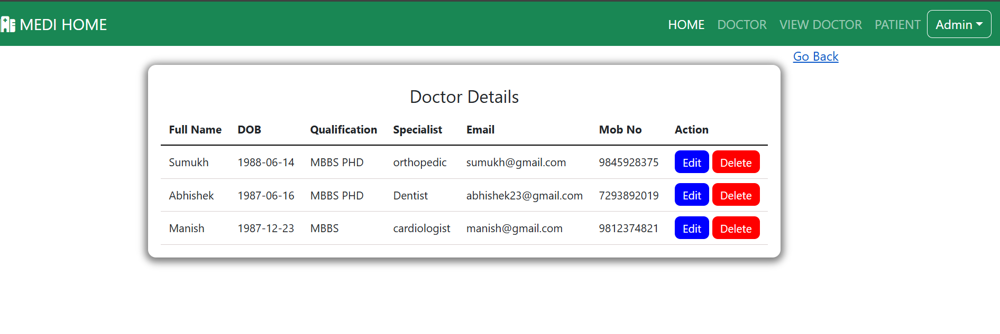

# 🏥 Hospital Management System

This is a **Java-based web application** that manages patient registrations, appointments, and user logins for a hospital. Built using **Servlets**, **JSP**, and **MySQL**, this project provides a basic hospital workflow management interface for both admins and patients.

---

## 📌 Features

- 🧾 **User Registration**: Patients can register with email, password, and personal information.
- 🔐 **Login System**: Authenticates users securely and redirects based on role (Admin/Patient).
- 📄 **Dynamic Dashboard**: Displays personalized content after login.
- 🏥 **Appointment Management**: Patients can book appointments; admins can view and manage them.
- 🗃️ **MySQL Integration**: Data like user records and appointments are stored in a structured database.
- 📤 **Auto Login After Registration**: Once registered, the user is automatically logged in and redirected to their dashboard.

---

## 🛠️ Technologies Used

- Java (Servlets, JSP)
- Apache Tomcat
- HTML/CSS
- Eclipse IDE
- MySQL
- JDBC
- Git & GitHub

---

## ⚙️ How to Run the Project

1. Clone the repository:
   ```bash
   git clone https://github.com/your-username/Hospital-Management-System.git
   ```
2. Import the project into Eclipse as a Maven or Dynamic Web Project.

3. Configure the database:
   - Create a MySQL database (e.g., hospital_db)
   - Run the provided SQL script or create required tables manually
     
4. Update database connection credentials in your DAO or utility class.

5. Deploy the project to Apache Tomcat from Eclipse.

6. Open browser and access:
```bash
 http://localhost:8080/Hospital-Management-System/
```
## 📽️ Demo (Hospital Management System)
### 🎥 Demo

[](https://youtu.be/1bVi-upXNs4)  
👉 [](https://youtu.be/1bVi-upXNs4)

---
# Hospital Management System

A simple web-based hospital management system that allows admins, doctors, and users to manage appointments, doctors, and patient information efficiently.

---
## 👨‍⚕️ Roles & Functionality

### 🔐 Admin

- **Login** with default credentials: `admin / admin123`
- Add, View, and Manage:
  - Doctors
  - Patients
  - Appointments
  - Specialists
- Update doctor details
- Monitor system dashboard stats

### 👨‍⚕️ Doctor

- Login with credentials provided by Admin
- View assigned patients
- Comment on patient records
- Update profile
- Change password

### 👤 User

- Register and login
- Book appointments
- View appointment status
- Change password


## 📌 Admin Information





---

## 👨‍⚕️ Doctor Information

Doctors have a login page similar to Admin. Credentials are provided by the Admin.


---

## 👤 User Information


---

## ✅ Features

- Admin Dashboard for managing doctors, users, and appointments.
- Doctor dashboard with patient management and profile features.
- User interface for booking and tracking appointments.
- Role-based access for Admin, Doctor, and User.

---

## 📸 Screenshots

All screenshots are located in the `screenShort/` folder and referenced throughout this README.

---

## 📂 Project Structure


# Set Up for Database 

## Overview
Below document provides the instructions to set up the database for the **Hospital Management System** using MySQL. The system uses four tables to manage data related to users, doctors, specialists, and appointments.

## Prerequisites
- MySQL 8.0 or higher (you can use other versions as well)
- Basic understanding of SQL
- A MySQL client to execute the SQL queries (e.g., MySQL Workbench, phpMyAdmin, or command-line MySQL)

## Steps to Set Up the Database

1. Create database in MySql I have used MySql 8.0 but you can use any.
   ``` CREATE DATABASE hospital_management_system  ```
   - The database will consist of four tables: user_details, doctor, specialist, and appointment. Follow the steps below to       create each table.
     
2. Create Tables
   2.1 create ```user_details``` tables
    ```
    CREATE TABLE user_details (
    id INT NOT NULL AUTO_INCREMENT,
    full_name VARCHAR(45) NOT NULL,
    email VARCHAR(25) NOT NULL,
    password VARCHAR(20) NOT NULL,
    PRIMARY KEY (id));
     ```

   2.2 Create ```doctor``` table
   ```
   CREATE TABLE doctor (
    id INT NOT NULL AUTO_INCREMENT,
    full_name VARCHAR(20) NOT NULL,
    dob VARCHAR(20) NOT NULL,
    qualification VARCHAR(20) NOT NULL,
    specalist VARCHAR(20) NOT NULL,
    email VARCHAR(45) NOT NULL,
    mobno VARCHAR(20) NOT NULL,
    password VARCHAR(20) NOT NULL,
    PRIMARY KEY (id));
```

2.3 Create ```Specalist``` Table
```CREATE TABLE specialist (
    id INT NOT NULL AUTO_INCREMENT,
    spec_name VARCHAR(20) NOT NULL,
    PRIMARY KEY (id));
```

2.4 Create ```Appointment``` table
```
CREATE TABLE appointment (
    id INT PRIMARY KEY NOT NULL AUTO_INCREMENT,
    user_id INT NOT NULL,
    fullname VARCHAR(20) NOT NULL,
    gender VARCHAR(20) NOT NULL,
    age VARCHAR(20) NOT NULL,
    appoint_date VARCHAR(20) NOT NULL,
    email VARCHAR(45) NOT NULL,
    phno VARCHAR(12) NOT NULL,
    diseases VARCHAR(25) NOT NULL,
    doctor_id INT NOT NULL,
    address VARCHAR(100) NOT NULL,
    status VARCHAR(100) NOT NULL,
    FOREIGN KEY (user_id) REFERENCES user_details(id) ON UPDATE CASCADE ON DELETE CASCADE,
    FOREIGN KEY (doctor_id) REFERENCES doctor(id) ON UPDATE CASCADE ON DELETE CASCADE);
```

   

## 🙌 Contribution

Feel free to fork and contribute. Pull requests are welcome.

---

## 📬 Contact

For queries, open an issue.


